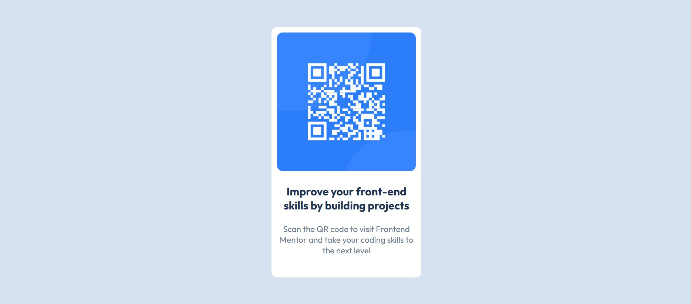

# Frontend Mentor - QR code component solution

This is a solution to the [QR code component challenge on Frontend Mentor](https://www.frontendmentor.io/challenges/qr-code-component-iux_sIO_H). Frontend Mentor challenges help you improve your coding skills by building realistic projects. 

## Table of contents

- [Overview](#overview)
  - [Screenshot](#screenshot)
  - [Links](#links)
- [My process](#my-process)
  - [Built with](#built-with)
  - [What I learned](#what-i-learned)
  - [Continued development](#continued-development)
  - [Useful resources](#useful-resources)

## Overview

### Screenshot

### Links

- Solution URL: (https://github.com/Michelle-developer/QR-code-component.git)

## My process

### Built with

- Semantic HTML5 markup
- CSS custom properties
- Flexbox

### What I learned

Frist, I try to centering items by [display:relative｜absolute] and Flexbox. It seems like both look fine on different kinds of screen. The key point to use Flexbox is that my codes get cleaner.

Second, I learn that [width/height:100%] and [100vw/vh] are different. When it comes to wider screen, using 100% become a better choice. 

### Continued development

I'm still puzzled by why my background color can't be centered vertically on longer screens, like iPad pro. I will keep on discovering possible solutions.

### Useful resources

- [resource 1](https://www.casper.tw/css/2015/01/16/css-magic/) - This helped me realizing CSS position better.